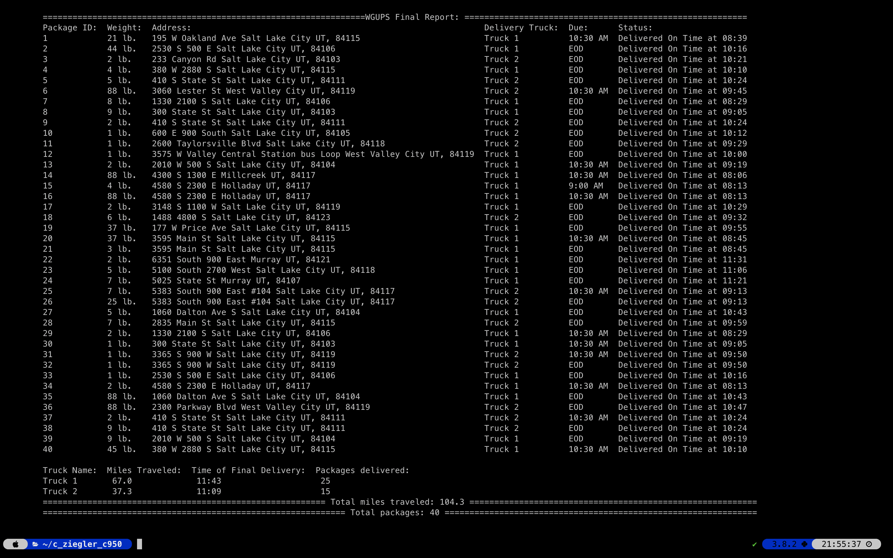
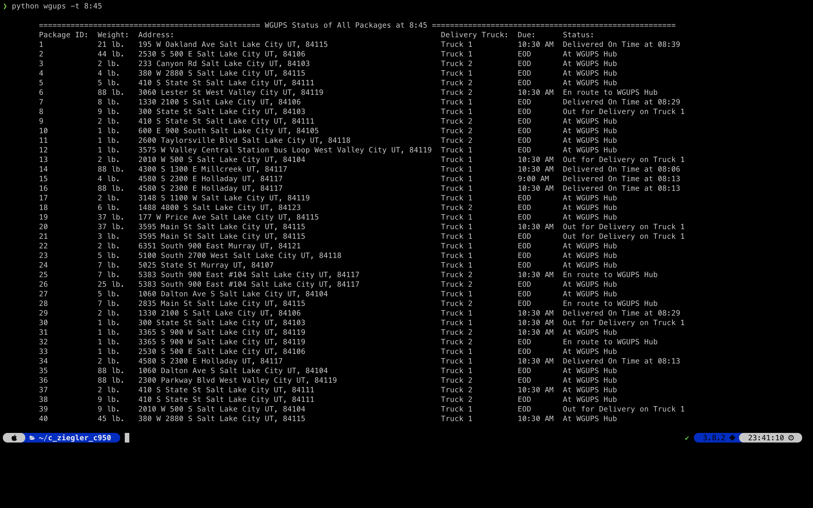
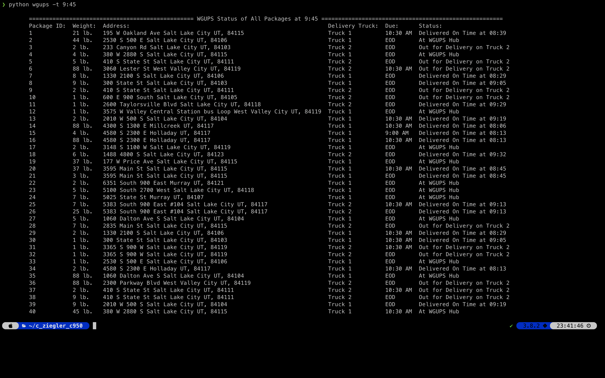
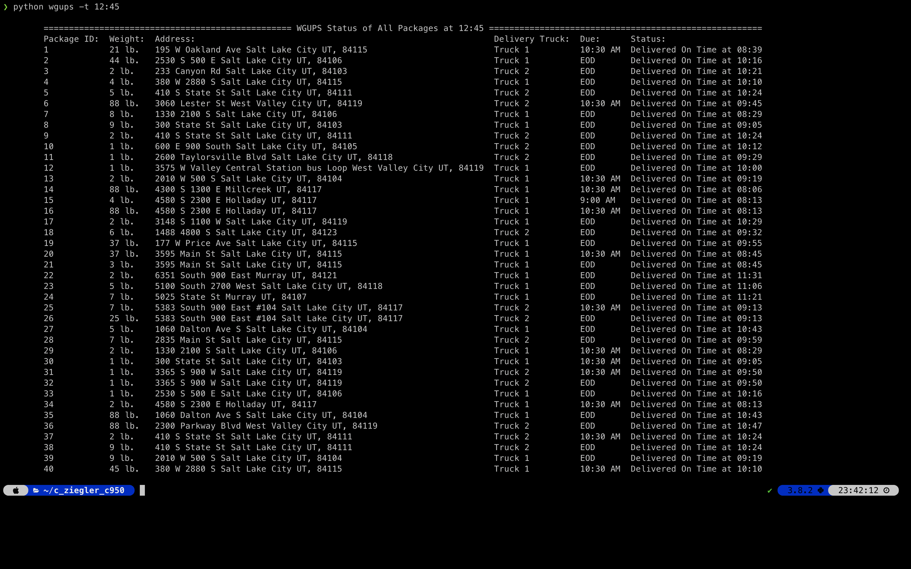

#### Chuck Ziegler
__Student ID:__ 00062285 __Data Structures and Algorithms II – C950__

---

## Problem overview

The Western Governors University Parcel Service (WGUPS) is having a issue with packages not being delivered by their promised deadlines. To alleviate the issue, WGUPS needs to determine the best route and delivery distribution system for their Daily Local Deliveries (DLD). The DLD has 3 trucks, 2 drivers, and average of 40 packages to deliver each day, and each package has specific delivery conditions.

##### Assumptions:

* Each truck can carry a maximum of 16 packages.
* Trucks travel at an average speed of 18 miles per hour.
* Trucks have a “infinite amount of gas” with no need to stop.
* Each driver stays with the same truck as long as that truck is in service.
* Drivers leave the hub at 8:00 a.m., with the truck loaded, and can return to the hub for packages if needed. The day ends when all 40 packages
have been delivered.
* Delivery time is instantaneous, i.e., no time passes while at a delivery (that time is factored into the average speed of the trucks).
* There is up to one special note for each package.
* The wrong delivery address for package #9, Third District Juvenile Court, will be corrected at 10:20 a.m. The correct address is 410 S State St., Salt Lake City, UT 84111.
* The package ID is unique; there are no collisions.
* No further assumptions exist or are allowed.

---
## WGUPS Algorithm 
#### ALGORITHM SELECTION, LOGIC COMMENTS
##### Requirements: A, B1

The WGUPS application is composed of of four main components which assure all 40 packages are delivered on time and abide by any special restrictions on the delivery. 

The first component ingests the distance data provided and uses a Dijkstra's shortest path algorithm to create an adjacency matrix that gives shortest path between all delivery locations.

##### Distance mapping Pseudocode(Dijkstra's shortest path algorithm):

    1. Create the adjacency matrix from the imported distance data
    2. For each location in matrix:
       1. Create a list of locations and set the distance of all to infinity (Distance list)
       2. Create another list of visited locations and set the values to False (Visited list)
       3. Set the source location distance to 0
       4. Find the neighboring location with the shortest distance to the source location
       5. Update location in the distance list if: 
            1. It is not in visited, 
            2. There is an path from the unvisited location to location
            3. the distance from the source location to the destination through the unvisited location is smaller than the current location
       6. Repeat from Step 4 until all locations are visited 
    3. Update the the adjacency matrix with the optimized distance information

The second component groups the packages together by address, then loads the package groups onto the either Truck 1 or Truck 2 or by the following outlined in the following pseudocode:

##### Delivery Planning Pseudocode:
    1. Group all packages by address
    2. Plan which truck will deliver which packages:
        If the package group has a package with the wrong address:
            Load group onto truck 2
        If the package group has a package that must be delivered with other packages:
            Load group onto Truck 1
        If the package group has a package that was delayed:
            Load group onto Truck 2
        If the package group has a package that must be delivered in the morning: 
            Load group onto truck 1
        IF he package group that does not meet any of the above criteria:
            Load group into 'Any' which can be delivered by either Truck 1 or Truck 2 

The third component loads the package groups onto the trucks:

##### Truck Loading Pseudocode:
    While the truck is not at max capacity:
        If there are no package groups that must be delivered by the truck, add package group from 'Any' the the Truck package list
        Load the truck with the package group in the truck's list
            add the number of packages in the group to the truck capacity
            IF the truck is at capacity:
                Deliver the packages
            If the number of packages in the next package group would put the truck over capacity:
                Deliver the packages

The forth component delivers the packages to their destinations

##### Package Delivery Pseudocode:

    Sort package groups on truck into three groups:
        1. Needs morning delivery: Priority list
        2. Cannot be delivered yet: Hold list
        3. No priority: Other list

    Deliver packages in the Priority list, then deliver the packages in the Other list
        While there are packages in the current list:
            Find the package group closest to the trucks current location
            Drive to the location and deliver the packages
            Check the current time
            If the time is greater than the time that the package in the hold list can be delivered:
                Add that package group to the current list

    Return to the WGUPS Hub

#### STRENGTHS OF THE CHOSEN ALGORITHM
##### Requirements: I1

One strength of the algorithm is that it finds the shortest distance between all locations to which the delivery trucks will travel. Also, the algorithm groups the packages into bundles by location address, so any one address would only need to be visited once. The total distance traveled by both trucks is under 105 miles.

#### VERIFICATION OF ALGORITHM
##### Requirements: I2
All packages were delivered on time and meeting all delivery constraints. The total milage traveled by both delivery trucks after all packages were delivered is 104.3 miles.
To verify this one can run the WGUPS program and generate the final report by running the program as so: `python wgups -f`.

#### OTHER POSSIBLE ALGORITHMS
##### Requirements: I3
The WGUPS application could use __A Star__ or __Bellman–Ford__ as alternate algorithms to Dijkstra's shortest path algorithm that is used to find the shortest paths between addresses.

#### ALGORITHM DIFFERENCES
##### Requirements: I3A
__A Star (A*)__ is a greedy algorithm that finds the shortest path between 2 locations. It is similar to Dijkstra's algorithm but also includes a heuristic to find the shortest path to the destination without needing to evaluate all possible distances between the location and the destination. 
##### Strength:
A* does not need to find the all possible distances from the source to all other locations. The heuristic gives the shortest path without having to traverse all locations in the map. This is much faster than Dijkstra's algorithm which does evaluate all locations between the location and the destination.
##### Weakness:
The implementation of Dijkstra's algorithm allows the program to create an adjacency matrix once that both trucks can use to find the distance between locations. A* would be used each time the trucks drive to a new location, adding computational complexity to the program.

__Bellman–Ford__ is an algorithm that utilizes dynamic programing to find the shortest path between 2 locations.
##### Strength:
Bellman-Ford can account for negative distances(weights). While this is not something that is an issue with the distance table as it is currently implemented, perhaps a route between to locations has road construction and cannot be used, a negative number in the list could represent this in the distance data.
##### Weakness:
Bellman-Ford is computationally more expensive than Dijkstra's algorithm $O(EV)$ vs. $O(E*logV)$.

#### SPACE-TIME AND BIG-O
##### Requirements: B3

The main program has a time complexity of $O(n^2*m*j)$ and a space complexity of $O(n)$.

For convenience, the space-time complexity of methods and functions in the WGUPS application are listed below.

##### WGUPS
| Method | Space Complexity | Time Complexity |
| :---: | :---: | :---: |
| _deliver_packages | $O(n)$ | $O(n^2*m*j)$ |
| final_report | $O(n)$ | $O(n^2*m*j)$ |
| get_time_package | $O(n)$ | $O(n^2*m*j)$ |
| get_time_all | $O(n)$ | $O(n^2*m*j)$ |
| _evaluate_package_time | $O(1)$| $O(1)$ |
| print_list | $O(n)$ | $O(n^2)$ |
| parse_time | $O(1)$ | $O(1)$ |
##### DATA_TABLE
| Function | Space Complexity | Time Complexity |
| :---: | :----: | :---: |
|parse_packages |$O(n)$ | $O(n)$ |
|parse_distance_name_data | $O(n)$|$O(n)$ |
|parse_distances | $O(n)$ | $O(n)$|
|parse_distance_name_data| $O(n)$ | $O(n)$ |
|parse_distances | $O(n)$ | $O(n)$ |
|package_hashmap | $O(n)$ | $O(n)$ |
|location_hashmap | $O(n)$ | $O(n)$ |
|get_distance_names |$O(1)$ | $(On)$ |
|get_distance_addresses | $O(1)$ | $O(1)$ |
##### TRUCK
| Method | Space Complexity | Time Complexity |
| :----: | :---: | :---: |
|drive| $O(1)$ | $O(1)$ |
return_to_hub | $O(1)$|$O(1)$
|get_distance_to_hub | $O(1)$ | $O(1)$ |
|load_and_deliver_packages| $O(1)$| $O(n*m*j)$|
|_Find_nearest | $O(n)$ | $O(n)$|
|_deliver_packages | $O(n)$ | $O(n^2)$ |
|_check_on_time | $O(1)$ | $O(1)$ |
##### PARSE_CSV
| Function | Space Complexity | Time Complexity  |
| :---: | :---: | :---: |
|parse_csv | $O(n)$ | $O(n)$ |
##### DISPATCH
| Function | Space Complexity | Time Complexity |
| :---: | :---: | :---: |
| plan_packages |  $O(n)$ |$O(n*m)$ |
| plan_truckload | $O(n)$ |$O(n*m)$ |
| dupe_address| $O(n)$ | $O(n)$ |
##### DISTANCE GRAPH
| Method | Space Complexity | Time Complexity  |
| :----: | :---: | :---: |
| create_graph | $O(n)$ | $O(n^2)$ |
| shorted_path| $O(n)$ | $O(n*log n )$ |
| shortest_adj_matrix| $O(n)$ | $O(n^2*log n)$|
##### HashTable
|   Method    | Space Complexity | Time Complexity |
| :---------: | :--------------: | :-------------: |
|  \_\_iter\_\_  | $O(1)$ | $O(n)$ |
| \_\_len\_\_ | $O(1)$ | $O(1)$ |
| add| $O(1)$ | $O(n)$ |
| get| $O(1)$ | $O(n)$ |
| delete| $O(1)$ | $O(1)$ |
| _increment_key | $O(1)$ | $O(1)$ |
| _find_item | $O(1)$ | $O(n)$ |
| _resize | $O(n)$ | $O(n)$ |

---
## WGUPS Data Structure
#### SELF-ADJUSTING DATA STRUCTURES
##### Requirements: B6
The hash table implementation is self adjusting as it will increase capacity and rehash the contents when reaching the max load of the structure, which is 50 percent of the current size of the array that is the hash table.

#### DATA STRUCTURE
##### Requirements: D
The data structure used to store the packages is is an open addressing linear probing hash table. The data structure is self adjusting as it will automatically resize and rehash as more data is added to the structure.

#### EXPLANATION OF DATA STRUCTURE
##### Requirements: D1
As stated above, the main data structure used to store the package data is an open addressing linear probing hash table. The the data structure is a list initialized to a size of 124. 

When adding a key value pair, the key is hashed using Python's built-in `hash()` function MOD the size of the array to find an index in the array that the key value pair can be stored. if the index already contains data, we check if the key is the same, if so, we update the value to the value given. If the key is different, we increment the index until an empty slot is found. If the hash table reaches 50 percent capacity, the data table is resized, and all the items are rehashed.

When searching for a key, the key is hashed using Python's built-in `hash()` function MOD the size of the array to find an index in the array that the key value pair is stored. If there is no data at that index, a `KeyError` is raised. If the key at that location does not match the asked for key, the index is incremented until the key is found, and a `KeyError` is raised if the key is not found.

#### HASH TABLE INSERT FUNCTION
##### Requirements: E
The hash table has a insertion function `add` that takes the package id as the key and a package object containing all other components as the value. For ease of use and to make the application more 'Pythonic' key value pairs can be added with the syntax `hashtable[key] = value`.

#### LOOK-UP FUNCTION
##### Requirements: F
The hash table has a lookup function `get`, that takes the package id key and returns the package information as the value. For ease of use and to make the application more 'Pythonic' values can be looked up with the syntax `hashtable[key]`.

#### VERIFICATION OF DATA STRUCTURE
##### Requirements: K1
All packages were delivered on time meeting all delivery constraints. The total milage traveled by both delivery trucks after all packages were delivered is 104.3 miles. The WGUPS application utilizes a hash table that includes a insert and lookup function, which is used to both store the packages, as well as display the data to verify the state of the packages at a given time.

To verify the correct delivery of all packages, run the WGUPS program and generate the final report by running the program as so: `python wgups -f`.

#### EFFICIENCY
##### Requirements: K1A
Adding packages to the hashtable has a worse case time complexity of $O(n)$ due to collisions that can happen when adding data to the hashtable. The hashtable tries to limit collisions by having a larger array to start, as well as incrementing the probe by 3 when a collision does occur. 

#### OVERHEAD
##### Requirements: K1B
In order to limit collisions when adding data to the hash table, the hash table has to be large compared to the amount of data stored. As such, the hash table will double in size when the table reached 50 percent capacity. In short, the hash table trades compactness for speed of addition and lookup.

#### IMPLICATIONS
##### Requirements: K1C
If more packages are added, the time to add or lookup packages should not change. If an appropriate initial capacity for the hash table is not selected, the table will constantly expand and rehash itself which is computationally expensive.

#### OTHER DATA STRUCTURES
##### Requirements: K2
WGUPS could use a  __hash table using array of linked lists__ or an __open addressing quadratic probing hash table__ rather than the __open addressing linear probing hash table__ that is used to store the packages in WGUPS application.

#### DATA STRUCTURE DIFFERENCES
##### Requirements: K2A
__hash table using array of linked lists__: Each linked list holds the key value pairs that share the same hash code. 

##### Strength:
There is no need to resize the hash table, as new items with the same hash are appended to the linked list corresponding hash value.

##### Weakness:
In open addressing hash table, all data is in the same array, as opposed a hash table using array of linked lists, where the array holding the data is pointed to by the array holding the hash values. It is faster to access the elements of an array rather than following a pointer to a linked list. 

__open addressing quadratic probing hash table__: This is the same implementation of the hash table used, but with a different way to deal with collisions. Rather than linearly probing for the next open slot, quadratic probing probes for <i>i</i>2'th  open slot in <i>i</i>'th iteration.

##### Strength:
An issue with open addressing hash tables is clustering, where items are stored close together. This slows finding a empty slot to place the data in the array. Quadratic probing limits this by reducing the placement of consecutive elements in the hash table.

##### Weakness:
Quadratic probing is more difficult to implement than linear probing. With more time, it would be worth refactoring the current linear probing hash table to one that uses quadratic probing.

---

## WGUPS Main Application
#### INTERFACE
##### Requirements: G
The WGUPS Application utilizes a simple __command-line interface__. To run the program, in a terminal window navigate to the folder `c_ziegler_c950` and type `python wgups`.

This will print the help menu of the program, which for convenience is also included here:
    
    usage: wgups [-h] [-f] [-t time] [-p id]

    ===========================================================================================================
    Charles Ziegler's Final Project for Western Governors University C950 -Data Structures and Algorithms II-
    ===========================================================================================================

    optional arguments:
    -h, --help            show this help message and exit
    -f, --final           Print the Final Report Showing the Final Result of All Packages, and the Total Milage Traveled
    -t time, --time time  Print the Status of All Packages at a Given Time (24 hour time in this format= HH:MM)
    -p id, --package id   Enter the Package ID after entering the time to see the status of that particular package at the givien time

            Examples:
                To see final report: wgups -f
                To see the status of all packages at  10:00: wgups -t 10:00
                To see the status of Package ID 1 at 8:30: wgups -t 8:30 -p 1

#### APPLICATION OF PROGRAMMING MODELS
##### Requirements: B2
The program was developed using VS Code in python 3.8.2 on a MacBook Pro running macOS 11.2. The application runs completely on the host computer; no communication protocols or network connection are needed.

#### ORIGINAL CODE
##### Requirements: C
The application runs using Python 3 and does relies only on the Python Standard Library. The application runs with no errors and guaranties delivery of all packages on time while meeting all constraints placed on the delivery of said packages.

#### IDENTIFICATION INFORMATION
##### Requirements:C1
Student name and ID number are included on the first line of the \_\_main\_\_.py file.

#### PROCESS AND FLOW COMMENTS
##### Requirements: C2
The code of the WGUPS application is annotated with docstrings and comments explaining the usage and flow of the code, and aligns with Google's Python style guide found in section 3.8: Comments and Docstrings of https://google.github.io/styleguide/pyguide.html.

#### ADAPTABILITY
##### Requirements: B4
The hash table used to contain the packages will automatically resize to accommodate more packages being added. Thus, increasing the number of packages to be delivered will not effect the efficiency of the application.

The main pathfinding algorithm takes all locations and creates a optimized table of distances that the delivery trucks use to drive their routes. This works as all address in the table correspond to the addresses of the packages. However, if the list of address is larger than the list of destinations, it would be more efficient to use another algorithm that does not compute all possible distances from each location, as there would be locations to which would never be driven.

#### SOFTWARE EFFICIENCY AND MAINTAINABILITY
##### Requirements: B5
The software runs in polynomial time $O(n^2*m*j)$ which meets the specifications for the program.

All classes and functions in the program are well documented and code blocks have comments as to the flow of the program to ensure that the purpose of each block of code can be understood easily.
            
#### DIFFERENT APPROACH
##### Requirements: J
Where I to repeat this project I would manually load the packages, until there was a more systematic way for the comments to give specific requirements of delivery. As such, there is a very basic algorithm that parses the package comment and places the packages on the correct delivery truck. However, the algorithm is very specific to the comments of the given packages, and would not scale to comments that are not in that group of known comments.

Another thing I would like to change is the pathfinding algorithm used optimize the distance table. Rather than use a monolithic optimized distance matrix, I would like to have the trucks find the nearest location as they travel. I would also implement a better function to limit collisions in the packages data structure. 

---

#### G1, G2, G3, H: Screen Shots of Package Status at Certain Times, and Final Status of the Packages and Total Miles Traveled. 
##### Screen shots also show the program execution
__Final Status of all packages, Total Miles Traveled, and Total Packages Delivered__

__Status of All Packages at 8:45__

__Status of All Packages at 9:45__

__Status of All Packages at 12:45__

---

#### SOURCES
##### Requirements: L
There are no sources referenced in this document.